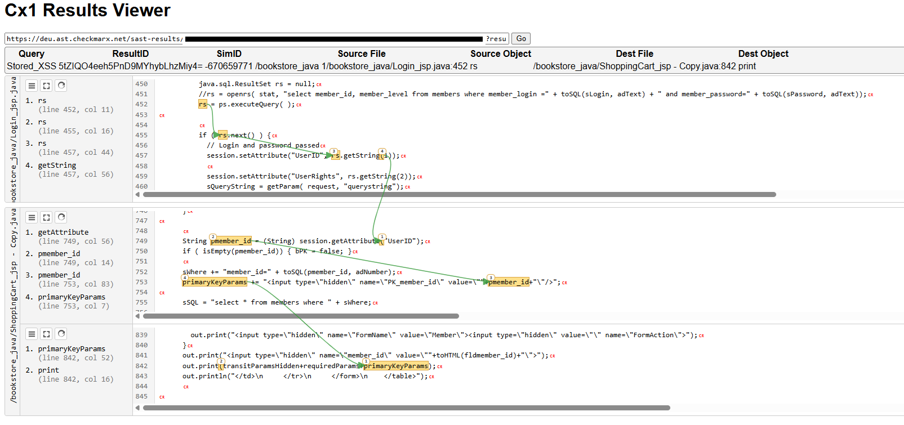

This is a light alternative UI for reviewing CheckmarxOne SAST results in bulk.
This application runs a light local http server and connects to the CheckmarxOne backend via API using APIKey or OAuth client authentication.
Usage: go run . -apikey %yourkey%
Help: go run . -h

